# 🛠️ Workshop: Algorithm & Flowchart

## 🏗️ Pseudocode practice

### Exercise 1: Find the Largest of Two Numbers (Decision)

1.  Takes two numbers, **A** and **B**, as input.

2.  Compares the two numbers.

3.  Displays which number is larger.

4.  If they are equal, display **"Both numbers are equal."**

**Solution**:

```text
START
    INPUT A
    INPUT B
    IF A > B THEN
        PRINT A
    ELSE IF B > A THEN
        PRINT B
    ELSE
        PRINT "Both numbers are equal."
    ENDIF
END
```

### Exercise 2: Sum of 5 Numbers (Loop + Accumulation)

1.  Reads **5 numbers** one by one.

2.  Calculates their **total sum**.

3.  Displays the final result.

**Solution**:

```text
START
    SET Sum = 0
    FOR 5 iterations
        INPUT A
        Sum += A
    ENDFOR
    PRINT Sum
END
```

---

## 🏗️ Flowchart practice

### Exercise 1: Voting Eligibility
Write a program that asks the user to enter their age.
- If the age is **18 or older**, display: "You are eligible to vote."
- If the age is **less than 18**, display: "You are not eligible to vote."
- End the program.

**Solution**:

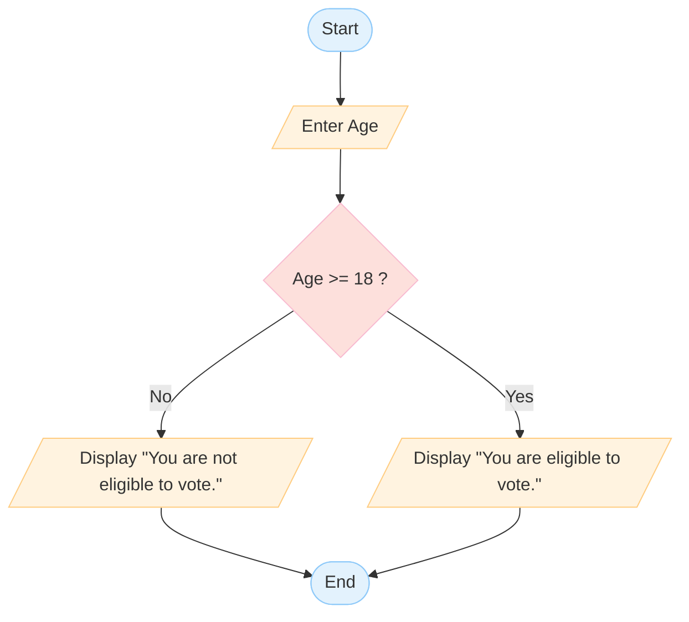
```mermaid
flowchart TD
    A([Start]):::term --> B[/Enter Age/]:::io
    B --> C{Age >= 18 ?}:::dec
    C -- No --> D[/Display "You are not eligible to vote."/]:::io
    C -- Yes --> E[/Display "You are eligible to vote."/]:::io
    D --> F([End]):::term
    E --> F([End]):::term

classDef term fill:#e3f2fd,stroke:#90caf9,color:#333,stroke-width:1px;
classDef io fill:#fff3e0,stroke:#ffcc80,color:#333,stroke-width:1px;
classDef dec fill:#fde0dc,stroke:#f8bbd0,color:#333,stroke-width:1px;
```

### Exercise 2: Student Grade Calculator
Write a program that takes a student's marks (out of 100) as input and determines their grade:
- **90 or above:** "Grade A"
- **75 to 89:** "Grade B"
- **50 to 74:** "Grade C"
- **Below 50:** "Fail"
- End the program.

**Solution**:

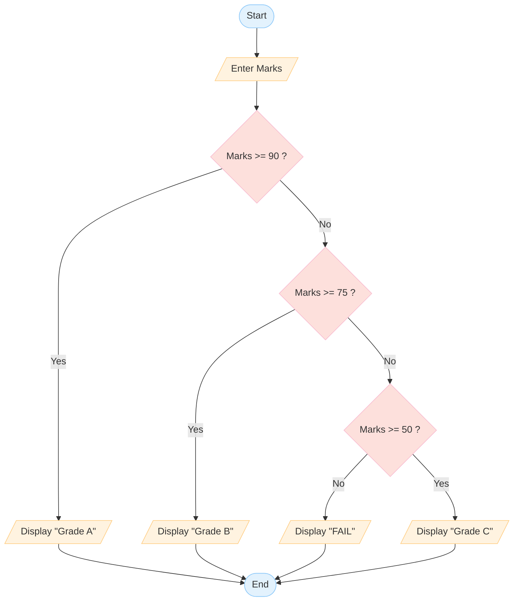
```mermaid
flowchart TD
    A([Start]):::term --> B[/Enter Marks/]:::io
    B --> C{Marks >= 90 ?}:::dec
    C -- No --> D{Marks >= 75 ?}:::dec
    C -- Yes --> E[/Display "Grade A"/]:::io
    E --> X([End]):::term
    D -- No --> F{Marks >= 50 ?}:::dec
    D -- Yes --> G[/ Display "Grade B"/]:::io
    G --> X([End]):::term
    F -- No --> H[/Display "FAIL"/]:::io
    F -- Yes --> I[/Display "Grade C"/]:::io
    H --> X([End]):::term
    I --> X([End]):::term

classDef term fill:#e3f2fd,stroke:#90caf9,color:#333,stroke-width:1px;
classDef io fill:#fff3e0,stroke:#ffcc80,color:#333,stroke-width:1px;
classDef dec fill:#fde0dc,stroke:#f8bbd0,color:#333,stroke-width:1px;
```

### Exercise 3: Simple Password Check
Write a program that:
1. Asks the user to enter a password.
2. Compares it with a stored password (e.g., "12345").
3. If they match, display: "Access Granted."
4. If they don't match, display: "Access Denied."
5. End the program.

**Solution**:

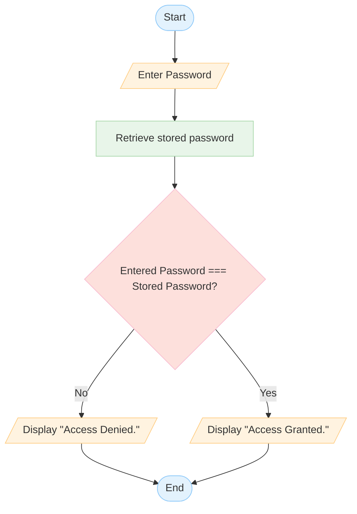
```mermaid
flowchart TD
    A([Start]):::term --> B[/Enter Password/]:::io
    B --> C[Retrieve stored password]:::proc
    C --> D{Entered Password === Stored Password?}:::dec
    D -- No --> F[/Display "Access Denied."/]:::io
    D -- Yes --> E[/Display "Access Granted."/]:::io
    F --> G([End]):::term
    E --> G([End]):::term

classDef term fill:#e3f2fd,stroke:#90caf9,color:#333,stroke-width:1px;
classDef io fill:#fff3e0,stroke:#ffcc80,color:#333,stroke-width:1px;
classDef dec fill:#fde0dc,stroke:#f8bbd0,color:#333,stroke-width:1px;
classDef proc fill:#e8f5e9,stroke:#a5d6a7,color:#333,stroke-width:1px;
```

### Exercise 4: Online Shopping Discount
Write a program that calculates the final price of an online order:
1. Input the **total purchase amount**.
2. If the amount is **5000 kr or more**, apply a **20% discount**.
3. If the amount is between **2000 kr and 4999 kr**, apply a **10% discount**.
4. If the amount is less than **2000 kr**, no discount is applied.
5. Calculate and display the **final price** after the discount.
6. End the program.

**Solution**:

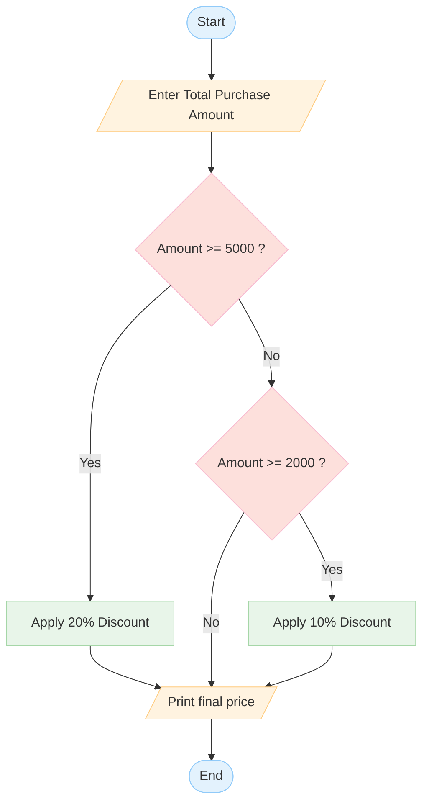
```mermaid
flowchart TD
    A([Start]):::term --> B[/Enter Total Purchase Amount/]:::io
    B --> C{Amount >= 5000 ?}:::dec
    C -- No --> D{Amount >= 2000 ?}:::dec
    C -- Yes --> E[Apply 20% Discount]:::proc
    E --> Y[/Print final price/]:::io
    Y --> X([End]):::term
    D -- No --> Y[/Print final price/]:::io
    D -- Yes --> F[Apply 10% Discount]:::proc
    F --> Y[/Print final price/]:::io
    

classDef term fill:#e3f2fd,stroke:#90caf9,color:#333,stroke-width:1px;
classDef io fill:#fff3e0,stroke:#ffcc80,color:#333,stroke-width:1px;
classDef dec fill:#fde0dc,stroke:#f8bbd0,color:#333,stroke-width:1px;
classDef proc fill:#e8f5e9,stroke:#a5d6a7,color:#333,stroke-width:1px;
```

### Exercise 5: Smart Parking Fee Calculator
Write a program that calculates the parking fee for a city garage:
1.  Ask the user for the **number of hours** parked (e.g., 4).
2.  If the time is **1 hour or less**, the fee is **0 kr** (Free).
3.  If the time is **between 1 and 3 hours**, the fee is a flat **50 kr**.
4.  If the time is **more than 3 hours**, calculate the fee as: **50 kr + (40 kr for every hour beyond the 3rd hour)**.
5.  If the calculated fee is **greater than 250 kr**, set the fee to **250 kr** (Maximum Daily Rate).
6.  Ask if the user has a **"Loyalty Card"**. If **Yes**, subtract **20%** from the fee.
7.  Display the **Final Fee** and end the program.

**Solution**:

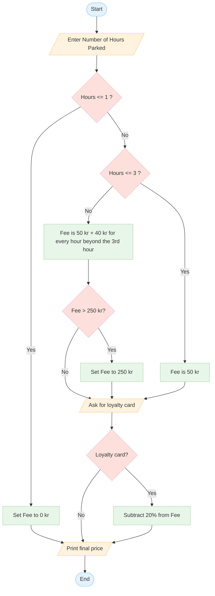
```mermaid
flowchart TD
    A([Start]):::term --> B[/Enter Number of Hours Parked/]:::io
    B --> C{Hours <= 1 ?}:::dec
    C -- No --> D{Hours <= 3 ?}:::dec
    C -- Yes --> E[Set Fee to 0 kr]:::proc
    E --> Z[/Print final price/]:::io
    Y -- No --> Z[/Print final price/]:::io
    Y -- Yes --> W[Subtract 20% from Fee]:::proc
    W --> Z[/Print final price/]:::io
    D -- No --> G[Fee is 50 kr + 40 kr for every hour beyond the 3rd hour]:::proc
    D -- Yes --> F[Fee is 50 kr]:::proc
    G --> H{Fee > 250 kr?}:::dec
    H -- No --> N[/Ask for loyalty card/]:::io
    H -- Yes --> K[Set Fee to 250 kr]:::proc
    K --> N[/Ask for loyalty card/]:::io
    F --> N[/Ask for loyalty card/]:::io
    N --> Y{Loyalty card?}:::dec
    Z --> X([End]):::term
    

classDef term fill:#e3f2fd,stroke:#90caf9,color:#333,stroke-width:1px;
classDef io fill:#fff3e0,stroke:#ffcc80,color:#333,stroke-width:1px;
classDef dec fill:#fde0dc,stroke:#f8bbd0,color:#333,stroke-width:1px;
classDef proc fill:#e8f5e9,stroke:#a5d6a7,color:#333,stroke-width:1px;
```
## 🏗️ Algorithm and Flowchart practice

### 1. Check Even or Odd Number
Design an algorithm and flowchart that take a number as input and
determine whether it is even or odd.

#### ✔ Pseudocode

```text
START
    INPUT number
    IF number % 2 == 0 THEN
        PRINT Even
    ELSE
        PRINT Odd
    ENDIF
END
```

#### ✔ Flowchart

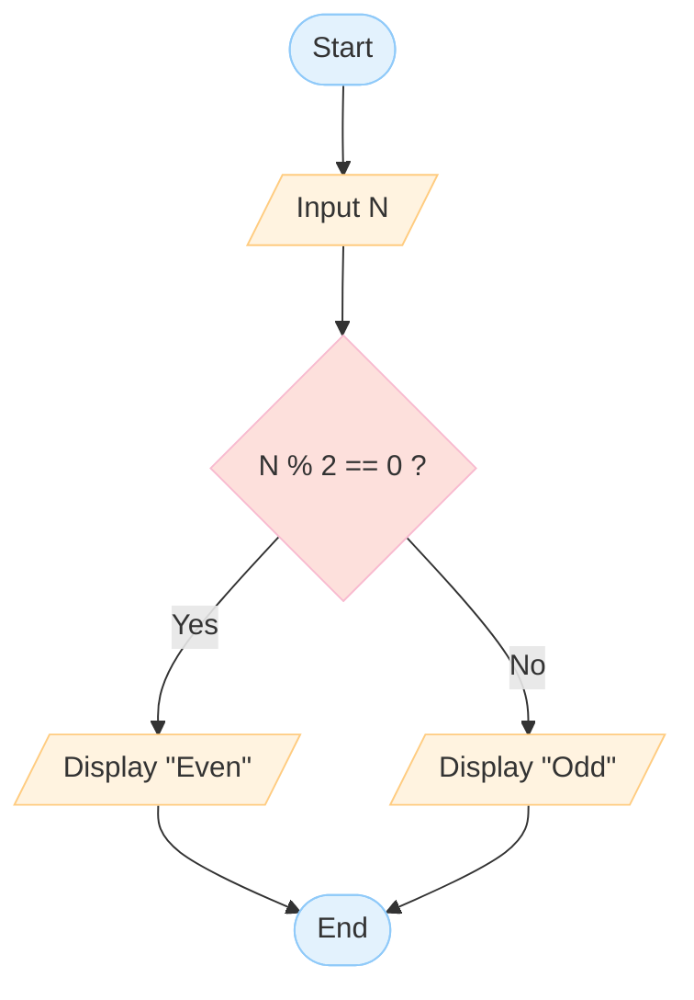
```mermaid
flowchart TD
    A([Start]):::term --> I[/Input N/]:::io
    I --> B{N % 2 == 0 ?}:::dec
    B -->|Yes| C[/Display "Even"/]:::io
    B -->|No| D[/Display "Odd"/]:::io
    C --> E([End]):::term
    D --> E([End]):::term

classDef term fill:#e3f2fd,stroke:#90caf9,color:#333,stroke-width:1px;
classDef io fill:#fff3e0,stroke:#ffcc80,color:#333,stroke-width:1px;
classDef dec fill:#fde0dc,stroke:#f8bbd0,color:#333,stroke-width:1px;
```

---

### 2. Calculate Total and Average Marks

Write the algorithm and draw the flowchart for a program that inputs
marks for 3 subjects, calculates the total and average, and displays
both.

#### ✔ Pseudocode

```text
START
    INPUT marksSubjectA
    INPUT marksSubjectB
    INPUT marksSubjectC
    SET total = marksSubjectA + marksSubjectB + marksSubjectC
    SET average = total / 3
    PRINT total
    PRINT average
END
```

#### ✔ Flowchart

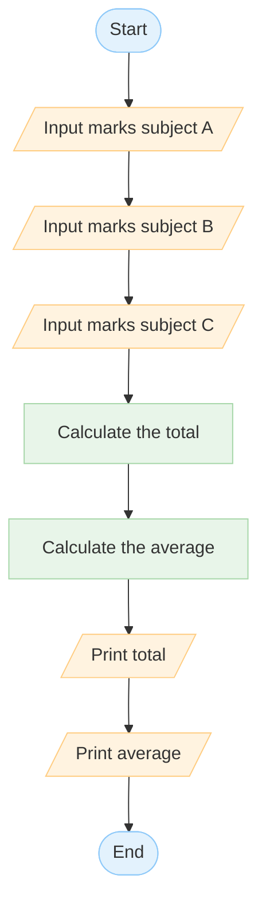
```mermaid
flowchart TD
    A([Start]):::term --> B[/Input marks subject A/]:::io
    B --> C[/Input marks subject B/]:::io
    C --> D[/Input marks subject C/]:::io
    D --> E[Calculate the total]:::proc
    E --> F[Calculate the average]:::proc
    F --> G[/Print total/]:::io
    G --> H[/Print average/]:::io
    H --> I([End]):::term

classDef term fill:#e3f2fd,stroke:#90caf9,color:#333,stroke-width:1px;
classDef io fill:#fff3e0,stroke:#ffcc80,color:#333,stroke-width:1px;
classDef proc fill:#e8f5e9,stroke:#a5d6a7,color:#333,stroke-width:1px;
```

---

### 3. Display Multiplication Table

Create an algorithm and flowchart that input a number and display its
multiplication table from 1 to 10 using a loop.

#### ✔ Pseudocode

```text
START
    INPUT number
    FOR i = 1 to 10
        SET result = i * number
        PRINT result
    ENDFOR
END
```

#### ✔ Flowchart

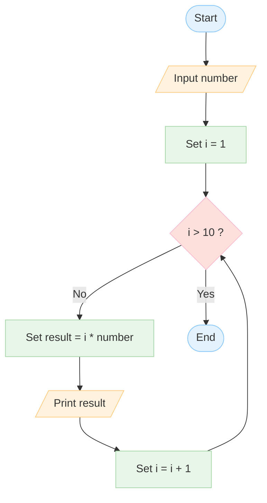
```mermaid
flowchart TD
    A([Start]):::term --> B[/Input number/]:::io
    B --> C[Set i = 1]:::proc
    C --> D{i > 10 ?}:::dec
    D -- No --> E[Set result = i * number]:::proc
    D -- Yes --> I([End]):::term
    E --> F[/Print result/]:::io
    F --> G[Set i = i + 1]:::proc
    G --> D

classDef term fill:#e3f2fd,stroke:#90caf9,color:#333,stroke-width:1px;
classDef io fill:#fff3e0,stroke:#ffcc80,color:#333,stroke-width:1px;
classDef dec fill:#fde0dc,stroke:#f8bbd0,color:#333,stroke-width:1px;
classDef proc fill:#e8f5e9,stroke:#a5d6a7,color:#333,stroke-width:1px;
```

---

### 4. Positive, Negative, or Zero Check

Write the algorithm and flowchart to input a number and display whether
it is positive, negative, or zero.

#### ✔ Pseudocode

```text
START
    INPUT number
    IF number > 0
        PRINT Positive
    ELSE IF number < 0
        PRINT Negative
    ELSE
        PRINT zero
END
```

#### ✔ Flowchart

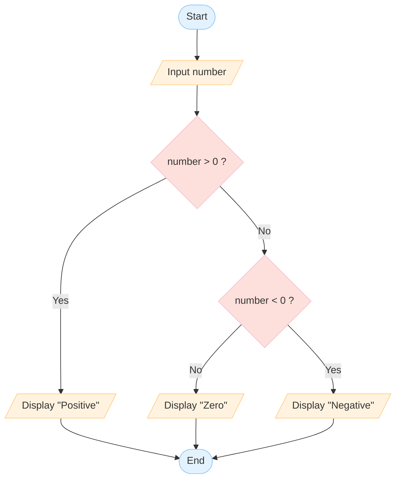
```mermaid
flowchart TD
    A([Start]):::term --> B[/Input number/]:::io
    B --> C{number > 0 ?}:::dec
    C -- No --> E{number < 0 ?}:::dec
    C -- Yes --> D[/Display "Positive"/]:::io
    D --> I([End]):::term
    E -- No --> F[/Display "Zero"/]:::io
    E -- Yes --> G[/Display "Negative"/]:::io
    F --> I([End]):::term
    G --> I([End]):::term

classDef term fill:#e3f2fd,stroke:#90caf9,color:#333,stroke-width:1px;
classDef io fill:#fff3e0,stroke:#ffcc80,color:#333,stroke-width:1px;
classDef dec fill:#fde0dc,stroke:#f8bbd0,color:#333,stroke-width:1px;
```

---

### 5. Simple Interest Calculator

Create an algorithm and flowchart for a program that calculates simple
interest using the formula:

**SI = (P × R × T) / 100**

- **P = Principal** → original amount of money
- **R = Rate of Interest** → percentage per year
- **T = Time** → number of years

#### ✔ Pseudocode

```text
START
    INPUT P
    INPUT R
    INPUT T
    SET SI = (P × R × T) / 100
    PRINT SI
END
```

#### ✔ Flowchart

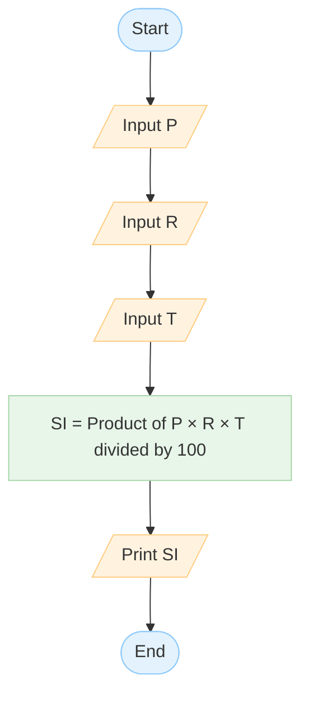
```mermaid
flowchart TD
    A([Start]):::term --> B[/Input P/]:::io
    B --> C[/Input R/]:::io
    C --> D[/Input T/]:::io
    D --> E[SI = Product of P × R × T divided by 100]:::proc
    E --> F[/Print SI/]:::io
    F --> I([End]):::term

classDef term fill:#e3f2fd,stroke:#90caf9,color:#333,stroke-width:1px;
classDef io fill:#fff3e0,stroke:#ffcc80,color:#333,stroke-width:1px;
classDef proc fill:#e8f5e9,stroke:#a5d6a7,color:#333,stroke-width:1px;
```

---

### 6. Average Temperature Calculation

Write the algorithm and draw the flowchart for a program that takes the
temperature of 7 days, finds the average temperature, and displays it.

#### ✔ Pseudocode

```text
START
    SET total = 0
    FOR i = 1 to 7
        INPUT temperature for day i
        SET total += temperature for day i
    ENDFOR
    SET average = total / 7
    PRINT average
END
```

#### ✔ Flowchart

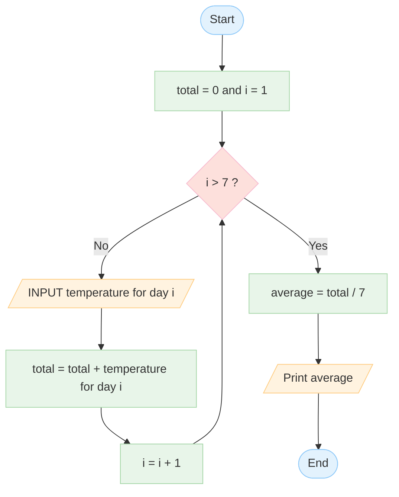
```mermaid
flowchart TD
    A([Start]):::term --> B[total = 0 and i = 1]:::proc
    B --> C{i > 7 ?}:::dec
    C -- No --> D[/INPUT temperature for day i/]:::io
    C -- Yes --> E[average = total / 7]:::proc
    E --> F[/Print average/]:::io
    F --> I([End]):::term
    D --> H[total = total + temperature for day i]:::proc
    H --> L[i = i + 1]:::proc
    L --> C{i > 7 ?}:::dec

classDef term fill:#e3f2fd,stroke:#90caf9,color:#333,stroke-width:1px;
classDef io fill:#fff3e0,stroke:#ffcc80,color:#333,stroke-width:1px;
classDef dec fill:#fde0dc,stroke:#f8bbd0,color:#333,stroke-width:1px;
classDef proc fill:#e8f5e9,stroke:#a5d6a7,color:#333,stroke-width:1px;
```

---

### 7. Calculate Area of a Rectangle

Create an algorithm and flowchart to input length and width, calculate
the area (**Area = Length × Width**), and display the result.

#### ✔ Pseudocode

```text
START
    INPUT length as a positive value
    INPUT width as a positive value
    SET area = length * width
    PRINT area
END
```

#### ✔ Flowchart

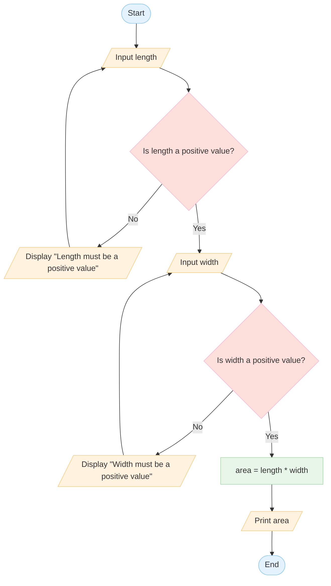
```mermaid
flowchart TD
    A([Start]):::term --> B[/Input length/]:::io
    B --> K{Is length a positive value?}:::dec
    K -- No --> X[/Display "Length must be a positive value"/]:::io
    X --> B[/Input length/]:::io
    K -- Yes --> C[/Input width/]:::io
    C --> L{Is width a positive value?}:::dec
    L -- No --> Y[/Display "Width must be a positive value"/]:::io
    Y --> C[/Input width/]:::io
    L -- Yes --> D[area = length * width]:::proc
    D --> F[/Print area/]:::io
    F --> I([End]):::term

classDef term fill:#e3f2fd,stroke:#90caf9,color:#333,stroke-width:1px;
classDef io fill:#fff3e0,stroke:#ffcc80,color:#333,stroke-width:1px;
classDef proc fill:#e8f5e9,stroke:#a5d6a7,color:#333,stroke-width:1px;
classDef dec fill:#fde0dc,stroke:#f8bbd0,color:#333,stroke-width:1px;
```

---

### 8. Determine Pass or Fail

Write the algorithm and draw the flowchart for a program that takes a
student's average marks and displays **"Pass"** if average ≥ 50,
otherwise **"Fail"**.

#### ✔ Pseudocode

```text
START
    INPUT average
    IF average >= 50
        PRINT "Pass"
    ELSE
        PRINT "Fail"
END
```

#### ✔ Flowchart

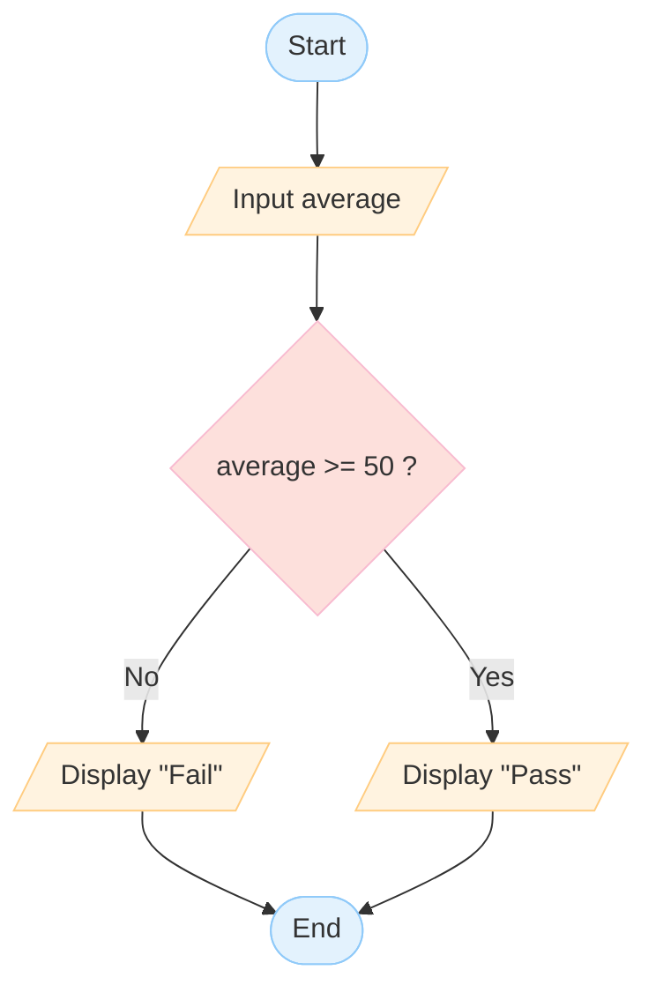
```mermaid
flowchart TD
    A([Start]):::term --> B[/Input average/]:::io
    B --> C{average >= 50 ?}:::dec
    C -- No --> D[/Display "Fail"/]:::io
    C -- Yes --> E[/Display "Pass"/]:::io
    D --> I([End]):::term
    E --> I([End]):::term

classDef term fill:#e3f2fd,stroke:#90caf9,color:#333,stroke-width:1px;
classDef io fill:#fff3e0,stroke:#ffcc80,color:#333,stroke-width:1px;
classDef dec fill:#fde0dc,stroke:#f8bbd0,color:#333,stroke-width:1px;
```

---

### 9. Calculate Factorial of a Number

Write the algorithm and draw the flowchart that input a number and
calculate its factorial using a loop.

#### ✔ Pseudocode

```text
START
    INPUT positive integer
    SET i = given positive integer
    SET factorial = 1
    WHILE i > 1
        SET factorial = factorial * i
        SET i = i - 1
    ENDWHILE
    PRINT factorial
END
```

#### ✔ Flowchart

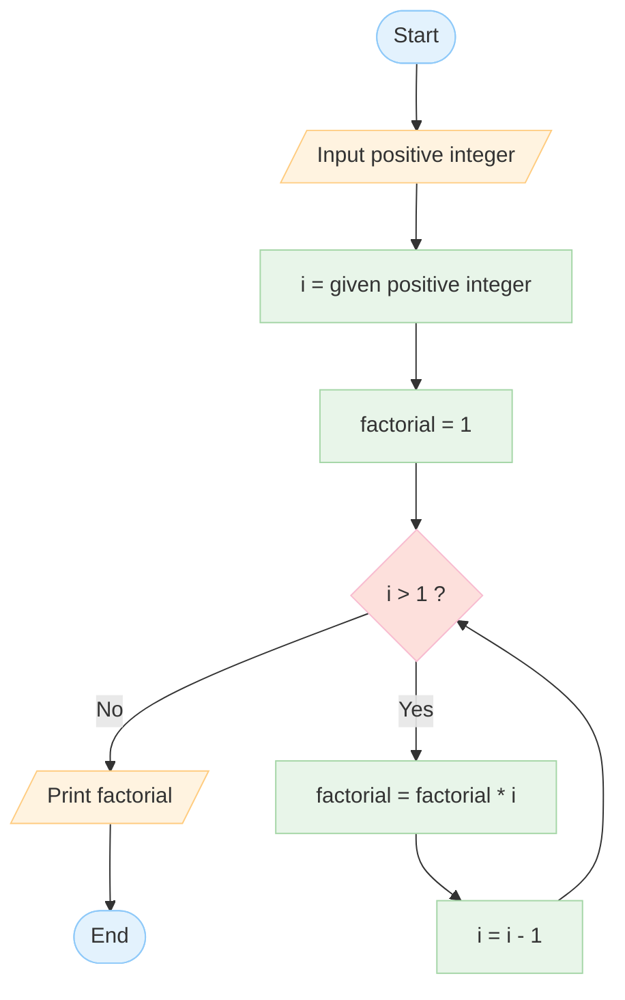
```mermaid
flowchart TD
    A([Start]):::term --> B[/Input positive integer/]:::io
    C --> D[factorial = 1]:::proc
    B --> C[i = given positive integer]:::proc
    D --> E{i > 1 ?}:::dec
    E -- No --> F[/Print factorial/]:::io
    E -- Yes --> G[factorial = factorial * i]:::proc
    G --> L[i = i - 1]:::proc
    L --> E{i > 1 ?}:::dec
    F --> I([End]):::term

classDef term fill:#e3f2fd,stroke:#90caf9,color:#333,stroke-width:1px;
classDef io fill:#fff3e0,stroke:#ffcc80,color:#333,stroke-width:1px;
classDef dec fill:#fde0dc,stroke:#f8bbd0,color:#333,stroke-width:1px;
classDef proc fill:#e8f5e9,stroke:#a5d6a7,color:#333,stroke-width:1px;
```

---

### 10. Calculate Discount on Purchase

Write the algorithm and draw the flowchart for a program that inputs the
purchase amount and gives a **10% discount** if the amount is greater
than 1000.

#### ✔ Pseudocode

```text
START
    INPUT purchase amount
    SET cost = purchase amount
    IF purchase amount > 1000
        SET cost = 0.9 * cost
    ENDIF
    PRINT cost
END
```

#### ✔ Flowchart

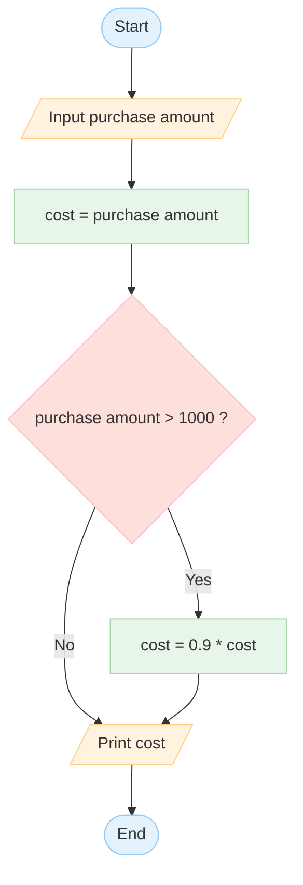
```mermaid
flowchart TD
    A([Start]):::term --> B[/Input purchase amount/]:::io
    C --> D{purchase amount > 1000 ?}:::dec
    B --> C[cost = purchase amount]:::proc
    D -- No --> F[/Print cost/]:::io
    D -- Yes --> G[cost = 0.9 * cost]:::proc
    G --> F[/Print cost/]:::io
    F --> I([End]):::term

classDef term fill:#e3f2fd,stroke:#90caf9,color:#333,stroke-width:1px;
classDef io fill:#fff3e0,stroke:#ffcc80,color:#333,stroke-width:1px;
classDef dec fill:#fde0dc,stroke:#f8bbd0,color:#333,stroke-width:1px;
classDef proc fill:#e8f5e9,stroke:#a5d6a7,color:#333,stroke-width:1px;
```

---

### 11. Online Shopping Delivery Eligibility

Write the algorithm and draw the flowchart for a program that inputs a
customer's purchase amount and displays **"Free Delivery"** if the
amount is 500 SEK or more; otherwise display **"Delivery Charge
Applies"**.

#### ✔ Pseudocode

```text
START
    INPUT purchase amount
    IF purchase amount >= 500
        PRINT "Free Delivery"
    ELSE
        PRINT "Delivery Charge Applies"
    ENDIF
END
```

#### ✔ Flowchart

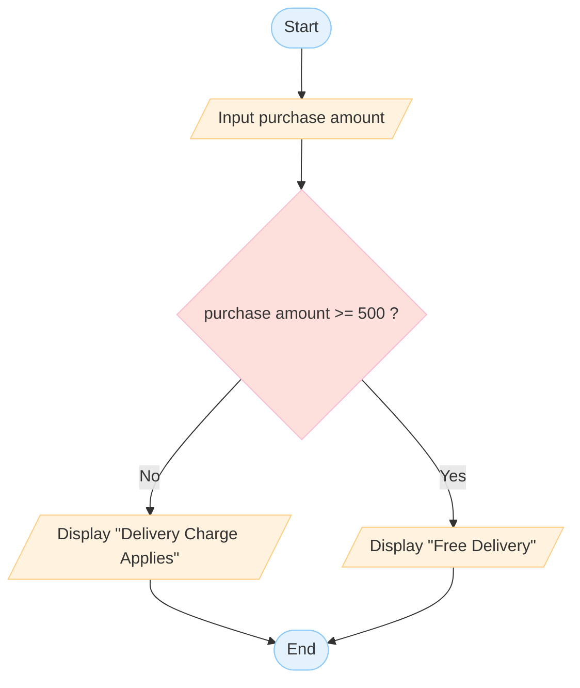
```mermaid
flowchart TD
    A([Start]):::term --> B[/Input purchase amount/]:::io
    B --> D{purchase amount >= 500 ?}:::dec
    D -- No --> F[/Display "Delivery Charge Applies"/]:::io
    D -- Yes --> G[/Display "Free Delivery"/]:::io
    F --> I([End]):::term
    G --> I([End]):::term

classDef term fill:#e3f2fd,stroke:#90caf9,color:#333,stroke-width:1px;
classDef io fill:#fff3e0,stroke:#ffcc80,color:#333,stroke-width:1px;
classDef dec fill:#fde0dc,stroke:#f8bbd0,color:#333,stroke-width:1px;
```

---

### 12. Employee Salary and Bonus Calculator

Write the algorithm and draw the flowchart for a program that inputs an
employee's monthly salary and years of service, calculates a bonus of
**10%** for employees with 5 or more years of service and **5%** for
others, then displays the bonus and total salary.

#### ✔ Pseudocode

```text
START
    INPUT monthly salary
    INPUT years of service
    SET bonus = 5%
    IF years of service >= 5
        SET bonus = 10%
    ENDIF
    PRINT bonus
    SET total salary = monthly salary * bonus
    PRINT total salary
END
```

#### ✔ Flowchart

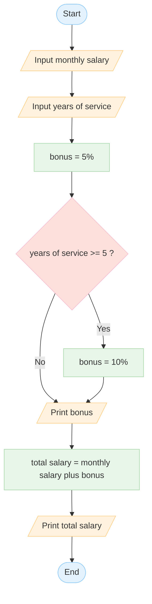
```mermaid
flowchart TD
    A([Start]):::term --> B[/Input monthly salary/]:::io
    B --> C[/Input years of service/]:::io
    C --> D[bonus = 5%]:::proc
    D --> E{years of service >= 5 ?}:::dec
    E -- No --> F[/Print bonus/]:::io
    E -- Yes --> G[bonus = 10%]:::proc
    G --> F[/Print bonus/]:::io
    F --> H[total salary = monthly salary plus bonus]:::proc
    H --> I[/Print total salary/]:::io
    I --> J([End]):::term

classDef term fill:#e3f2fd,stroke:#90caf9,color:#333,stroke-width:1px;
classDef io fill:#fff3e0,stroke:#ffcc80,color:#333,stroke-width:1px;
classDef dec fill:#fde0dc,stroke:#f8bbd0,color:#333,stroke-width:1px;
classDef proc fill:#e8f5e9,stroke:#a5d6a7,color:#333,stroke-width:1px;
```

---

### 13. Mobile Data Usage Monitor

Write the algorithm and draw the flowchart for a program that inputs a
user's monthly data limit and data usage, then displays whether the user
has exceeded the limit or how much data remains.

#### ✔ Pseudocode

```text
START
    INPUT monthly data limit
    INPUT data usage
    SET data remaining = monthly data limit - data usage
    IF data remaining < 0
        PRINT "Limit has been exceeded"
    ELSE
        PRINT data remaining
    ENDIF
END
```

#### ✔ Flowchart

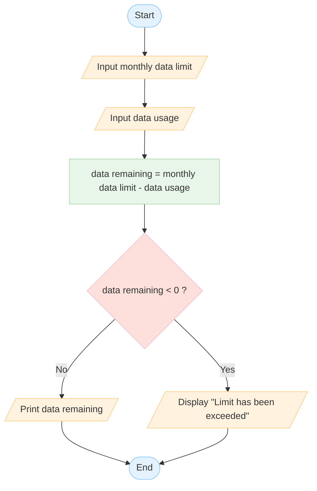
```mermaid
flowchart TD
    A([Start]):::term --> B[/Input monthly data limit/]:::io
    B --> C[/Input data usage/]:::io
    C --> D[data remaining = monthly data limit - data usage]:::proc
    D --> E{data remaining < 0 ?}:::dec
    E -- No --> F[/Print data remaining/]:::io
    E -- Yes --> G[/Display "Limit has been exceeded"/]:::io
    F --> J([End]):::term
    G --> J([End]):::term

classDef term fill:#e3f2fd,stroke:#90caf9,color:#333,stroke-width:1px;
classDef io fill:#fff3e0,stroke:#ffcc80,color:#333,stroke-width:1px;
classDef dec fill:#fde0dc,stroke:#f8bbd0,color:#333,stroke-width:1px;
classDef proc fill:#e8f5e9,stroke:#a5d6a7,color:#333,stroke-width:1px;
```

---

### 14. Login System (Maximum 3 Attempts)

Create an algorithm and flowchart for a login system that allows a user
up to 3 attempts to enter the correct password. Display **"Access
Granted"** if the password is correct; otherwise display **"Account
Locked"** after 3 failed attempts.

#### ✔ Pseudocode

```text
START
    SET attempts = 0
    SET granted = false
    SET correctPassword = 'correct_password'

    WHILE attempts < 3 AND !granted
        INPUT password
        SET attempts += 1
        IF password == correctPassword
            SET granted = true
        ENDIF
    ENDWHILE

    IF granted
        Display "Access Granted"
    ELSE
        Display "Account Locked"
    ENDIF
END
```

#### ✔ Flowchart

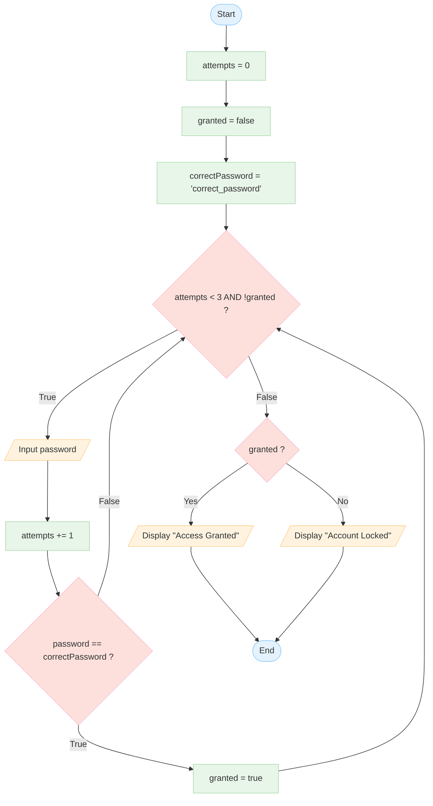
```mermaid
flowchart TD
    A([Start]):::term --> B[attempts = 0]:::proc
    B --> Y[granted = false]:::proc
    Y --> W[correctPassword = 'correct_password']:::proc
    W --> C{attempts < 3 AND !granted ?}:::dec
    C -- False --> D{granted ?}:::dec
    C -- True --> F[/Input password/]:::io
    D -- Yes --> E[/Display "Access Granted"/]:::io
    D -- No --> G[/Display "Account Locked"/]:::io
    F --> H[attempts += 1]:::proc
    H --> K{password == correctPassword ?}:::dec
    K -- False --> C{attempts < 3 AND !granted ?}:::dec
    K -- True --> X[granted = true]:::proc
    X --> C{attempts < 3 AND !granted ?}:::dec
    E --> J([End]):::term
    G --> J([End]):::term

classDef term fill:#e3f2fd,stroke:#90caf9,color:#333,stroke-width:1px;
classDef io fill:#fff3e0,stroke:#ffcc80,color:#333,stroke-width:1px;
classDef dec fill:#fde0dc,stroke:#f8bbd0,color:#333,stroke-width:1px;
classDef proc fill:#e8f5e9,stroke:#a5d6a7,color:#333,stroke-width:1px;
```

---

### 15. Store Checkout with Multiple Items

Write the algorithm and draw the flowchart for a program that inputs the
number of items purchased, calculates the total purchase amount using a
loop, and applies a **15% discount** if the total exceeds 5000 SEK.

#### ✔ Pseudocode

```text
START
    INPUT number of items purchased
    SET i = 0
    SET total = 0
    WHILE i < number of items purchased
        SET total += items[i].price
        SET i += 1
    ENDWHILE

    IF total > 5000
        SET total = total * 0.85
    ENDIF
    PRINT total
END
```

#### ✔ Flowchart

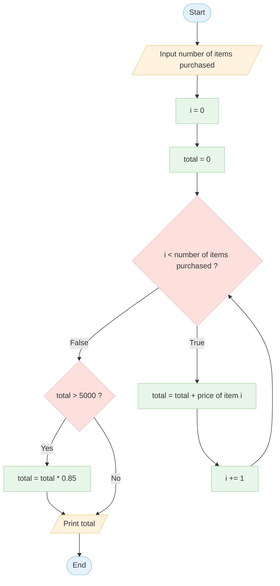
```mermaid
flowchart TD
    A([Start]):::term --> B[/Input number of items purchased/]:::io
    B --> Y[i = 0]:::proc
    Y --> W[total = 0]:::proc
    W --> C{i < number of items purchased ?}:::dec
    C -- False --> D{total > 5000 ?}:::dec
    C -- True --> F[total = total + price of item i]:::proc
    D -- Yes --> E[total = total * 0.85]:::proc
    D -- No --> G[/Print total/]:::io
    F --> H[i += 1]:::proc
    H --> C{i < number of items purchased ?}:::dec
    E --> G[/Print total/]:::io
    G --> J([End]):::term

classDef term fill:#e3f2fd,stroke:#90caf9,color:#333,stroke-width:1px;
classDef io fill:#fff3e0,stroke:#ffcc80,color:#333,stroke-width:1px;
classDef dec fill:#fde0dc,stroke:#f8bbd0,color:#333,stroke-width:1px;
classDef proc fill:#e8f5e9,stroke:#a5d6a7,color:#333,stroke-width:1px;
```

---
