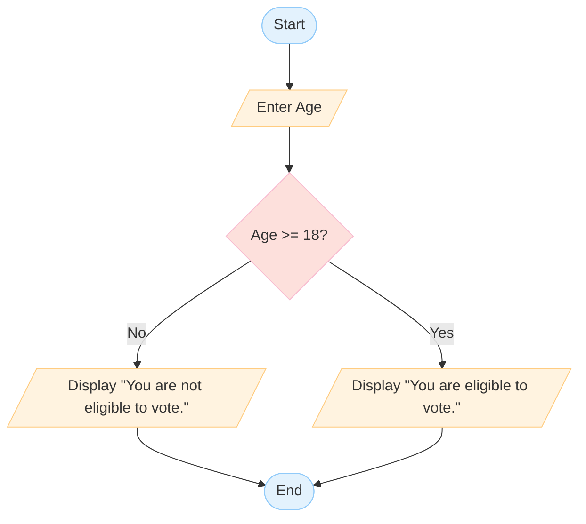
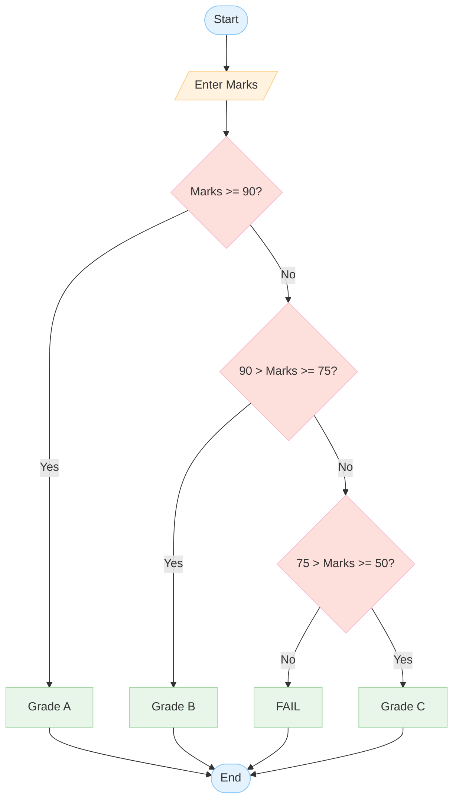
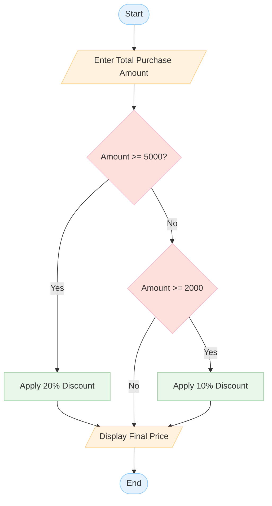
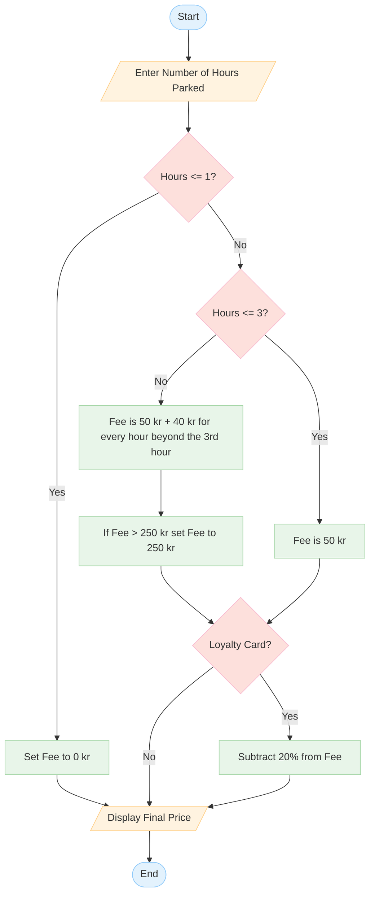

# 🛠️ Workshop: Algorithm & Flowchart

## 🏗️ Pseudocode practice

### Exercise 1: Find the Largest of Two Numbers (Decision)

1.  Takes two numbers, **A** and **B**, as input.

2.  Compares the two numbers.

3.  Displays which number is larger.

4.  If they are equal, display **"Both numbers are equal."**

**Solution**:

```text
Start
Input A
Input B
If A > B Then
    Display A
Else If B > A Then
    Display B
Else
    Display "Both numbers are equal."
EndIf
End
```

### Exercise 2: Sum of 5 Numbers (Loop + Accumulation)

1.  Reads **5 numbers** one by one.

2.  Calculates their **total sum**.

3.  Displays the final result.

**Solution**:

```text
Start
Variable Sum = 0
Loop 5 times
    Input A
    Sum += A
EndLoop
Display Sum
End
```

---

## 🏗️ Flowchart practice

### Exercise 1: Voting Eligibility
Write a program that asks the user to enter their age.
- If the age is **18 or older**, display: "You are eligible to vote."
- If the age is **less than 18**, display: "You are not eligible to vote."
- End the program.

**Solution**:



### Exercise 2: Student Grade Calculator
Write a program that takes a student's marks (out of 100) as input and determines their grade:
- **90 or above:** "Grade A"
- **75 to 89:** "Grade B"
- **50 to 74:** "Grade C"
- **Below 50:** "Fail"
- End the program.

**Solution**:



### Exercise 3: Simple Password Check
Write a program that:
1. Asks the user to enter a password.
2. Compares it with a stored password (e.g., "12345").
3. If they match, display: "Access Granted."
4. If they don't match, display: "Access Denied."
5. End the program.

**Solution**:


### Exercise 4: Online Shopping Discount
Write a program that calculates the final price of an online order:
1. Input the **total purchase amount**.
2. If the amount is **5000 kr or more**, apply a **20% discount**.
3. If the amount is between **2000 kr and 4999 kr**, apply a **10% discount**.
4. If the amount is less than **2000 kr**, no discount is applied.
5. Calculate and display the **final price** after the discount.
6. End the program.

**Solution**:



### Exercise 5: Smart Parking Fee Calculator
Write a program that calculates the parking fee for a city garage:
1.  Ask the user for the **number of hours** parked (e.g., 4).
2.  If the time is **1 hour or less**, the fee is **0 kr** (Free).
3.  If the time is **between 1 and 3 hours**, the fee is a flat **50 kr**.
4.  If the time is **more than 3 hours**, calculate the fee as: **50 kr + (40 kr for every hour beyond the 3rd hour)**.
5.  If the calculated fee is **greater than 250 kr**, set the fee to **250 kr** (Maximum Daily Rate).
6.  Ask if the user has a **"Loyalty Card"**. If **Yes**, subtract **20%** from the fee.
7.  Display the **Final Fee** and end the program.

**Solution**:


